# GameSync Themes

A community gallery of color themes for
[**GameSync**](https://github.com/nickPisano/GameSync), the desktop game-save
backup & sync app. Browse the gallery below, grab a theme's JSON, and paste it
into GameSync to restyle the whole app.

> Looking for the app itself? It lives at
> [github.com/nickPisano/GameSync](https://github.com/nickPisano/GameSync).

Every theme here is validated in CI and checked for strong text-on-background
contrast, so they stay readable on real displays.

---

## Install a theme into GameSync

1. Open the theme's `.json` file from the [gallery](#gallery) (click the link in
   the **Theme** column) and copy its contents — or download the file.
2. In GameSync, go to **Settings → Appearance**.
3. Choose **Import** and select the downloaded `.json` file, **or** **Paste
   JSON** and paste the contents you copied.
4. Apply. The new colors take effect immediately.

To switch back, import a different theme or restore the default from the same
screen.

> **Tip:** A theme only needs the six required colors (`bg`, `panel`, `border`,
> `text`, `muted`, `accent`). The rest are optional and fall back to sensible
> defaults — see [Theme format](#theme-format).

---

## Gallery

Each preview is a mock GameSync window rendered in that theme — showing the
background layers, text, accent button, and `ok`/`warn`/`err` status colors.
Click a preview to open its `.json`.

<!-- GALLERY:START (auto-generated by scripts/generate-gallery.mjs — do not edit) -->

### Dark

| | |
|:--:|:--:|
| [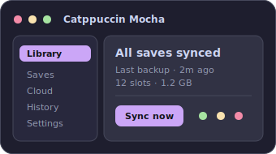<br>Catppuccin Mocha](themes/catppuccin-mocha.json) | [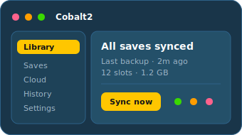<br>Cobalt2](themes/cobalt2.json) |
| [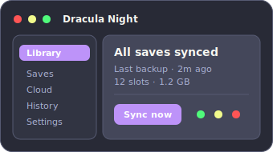<br>Dracula Night](themes/dracula-night.json) | [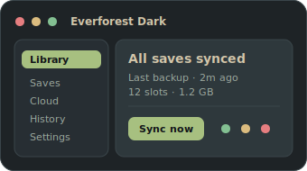<br>Everforest Dark](themes/everforest-dark.json) |
| [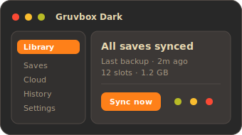<br>Gruvbox Dark](themes/gruvbox-dark.json) | [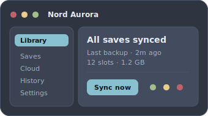<br>Nord Aurora](themes/nord-aurora.json) |
| [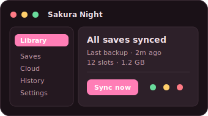<br>Sakura Night](themes/sakura-night.json) | [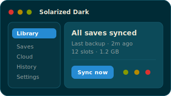<br>Solarized Dark](themes/solarized-dark.json) |
| [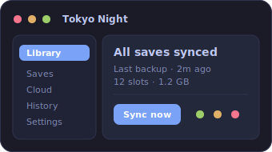<br>Tokyo Night](themes/tokyo-night.json) |  |

### Light

| | |
|:--:|:--:|
| [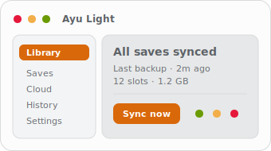<br>Ayu Light](themes/ayu-light.json) | [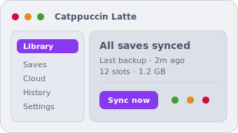<br>Catppuccin Latte](themes/catppuccin-latte.json) |
| [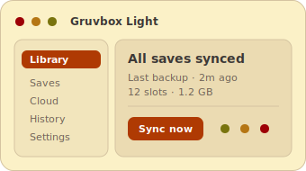<br>Gruvbox Light](themes/gruvbox-light.json) | [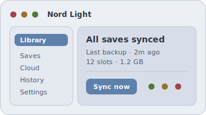<br>Nord Light](themes/nord-light.json) |
| [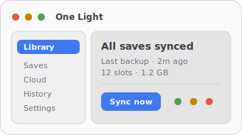<br>One Light](themes/one-light.json) | [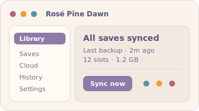<br>Rosé Pine Dawn](themes/rose-pine-dawn.json) |
| [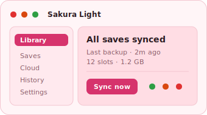<br>Sakura Light](themes/sakura-light.json) | [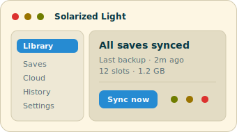<br>Solarized Light](themes/solarized-light.json) |

<!-- GALLERY:END -->

Previews and this gallery are generated from the theme files (`npm run previews`
and `npm run gallery`). A machine-readable catalog of all themes lives in
[`themes/index.json`](themes/index.json).

---

## Theme format

One `.json` file per theme:

```json
{
  "name": "Theme name (max 40 chars)",
  "colors": {
    "bg": "#0f1216", "panel": "#171b21", "panel-2": "#1e242c",
    "border": "#2a313b", "text": "#e6e9ee", "muted": "#8b95a3",
    "accent": "#4f8cff", "accent-hover": "#3d7bf0",
    "ok": "#3fb950", "err": "#f85149", "warn": "#d29922"
  }
}
```

**Required:** `bg`, `panel`, `border`, `text`, `muted`, `accent`.

**Optional:** `panel-2` (defaults to `panel`), `accent-hover` (defaults to
`accent`), `ok`, `err`, `warn`.

All values are `#rrggbb` hex. The `name` is at most 40 characters.

| Key | Role |
|---|---|
| `bg` | Base background — the darkest (or lightest) layer |
| `panel` | Panel / surface background |
| `panel-2` | Raised panel background |
| `border` | Borders and dividers |
| `text` | Primary foreground text |
| `muted` | Secondary / muted text |
| `accent` | Interactive / brand color |
| `accent-hover` | Accent hover state |
| `ok` / `err` / `warn` | Success / error / warning status colors |

The formal definition lives in
[`schema/theme.schema.json`](schema/theme.schema.json).

---

## Repository layout

```
themes/             One .json per theme, plus a generated index.json catalog
schema/             JSON Schema for a theme file
scripts/            Node validator + index/preview/gallery generators (zero deps)
assets/previews/    Generated SVG preview for each theme (used by the gallery)
.github/workflows/  CI that validates every theme on each PR
```

## Validate and regenerate locally

Requires Node.js 18+. No dependencies to install.

```bash
node scripts/validate.mjs            # validate every theme in themes/
node scripts/generate-index.mjs      # regenerate themes/index.json
node scripts/generate-previews.mjs   # regenerate assets/previews/*.svg
node scripts/generate-gallery.mjs    # regenerate the README gallery
```

Or via npm:

```bash
npm run validate
npm run build     # regenerate index.json, previews, and the README gallery
npm run check     # validate + verify all generated files are current (CI)
```

## Contributing

New themes are welcome — see [CONTRIBUTING.md](CONTRIBUTING.md). In short: add
one `.json` file to `themes/`, run `npm run validate` and `npm run build`, and
open a pull request.

## License

[MIT](LICENSE).
